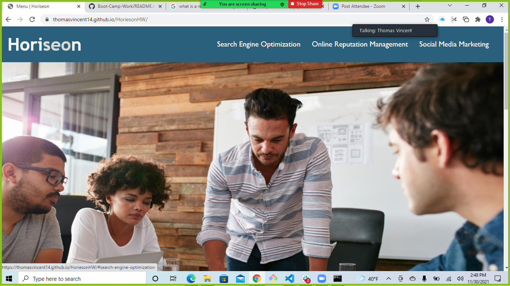

# HoriesonHW
[App](assets/images/brand-awareness.png?raw=true "A")
## Description
Provide a short description explaining the what, why, and how of your project. Use the following questions as a guide:
- The motivation for this project was to clean up the website to make it more presentable and accessible for visually impaired individuals. I didn't build this particular but I did do mostly all refactoring to get the results I needed. This project taught me that companies can be held liable if their website is not accessible for handicapped individuals. 

## Installation
The first thing I did to get the website where it should be was that I first changed the title in line 7 from 'webiste" to "Menu | Horieson". I then changed a few "div" properties to "nav" to help VS code figure out where to go in the code. Next, I added "alt text" to all the images on the page by putting "alt=text" next to the image link. To get the "SEO" tab to take the user to the search engine optimization paragraph, I incorporated a "div id" property in line 30.

## Usage
In order to optimize the total usage of the changes I made, you would simply have to click on the "SEO" tab and have to direct you to the paragraph about search engine optimization. To get a clearer understanding of the images, you would have to hover over the images themselves. To understand where you are on the company website, you would have to look up at the title tab on the webpage.

    
    
## Credits
I received assistance fro mmy tutor, Suresh Kumar. He helped me get started and helped to go over some mechanics and shortcuts.
## License
MIT License

Copyright (c) [2021] [Thomas Vincent]

Permission is hereby granted, free of charge, to any person obtaining a copy
of this software and associated documentation files (the "Software"), to deal
in the Software without restriction, including without limitation the rights
to use, copy, modify, merge, publish, distribute, sublicense, and/or sell
copies of the Software, and to permit persons to whom the Software is
furnished to do so, subject to the following conditions:

The above copyright notice and this permission notice shall be included in all
copies or substantial portions of the Software.

THE SOFTWARE IS PROVIDED "AS IS", WITHOUT WARRANTY OF ANY KIND, EXPRESS OR
IMPLIED, INCLUDING BUT NOT LIMITED TO THE WARRANTIES OF MERCHANTABILITY,
FITNESS FOR A PARTICULAR PURPOSE AND NONINFRINGEMENT. IN NO EVENT SHALL THE
AUTHORS OR COPYRIGHT HOLDERS BE LIABLE FOR ANY CLAIM, DAMAGES OR OTHER
LIABILITY, WHETHER IN AN ACTION OF CONTRACT, TORT OR OTHERWISE, ARISING FROM,
OUT OF OR IN CONNECTION WITH THE SOFTWARE OR THE USE OR OTHER DEALINGS IN THE
SOFTWARE.

## Tests
